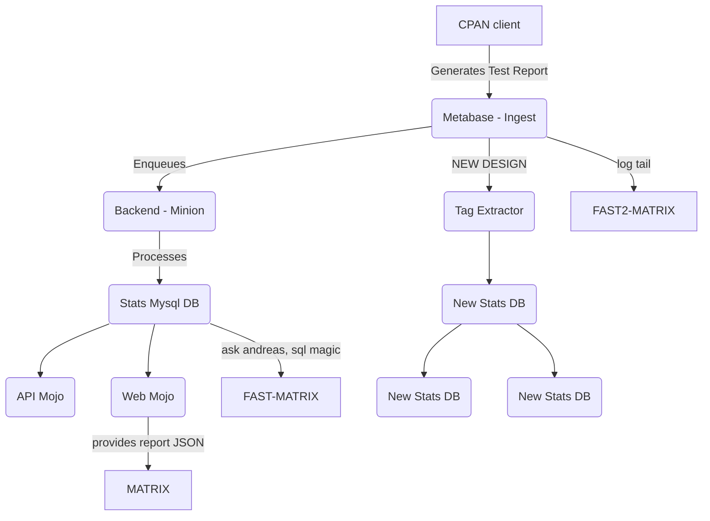

This flowchart describes where a test report goes. It's most easily edited with https://mermaid.live

```mermaid
flowchart TD
    A[CPAN client] -->|Generates Test Report| B(Metabase - Ingest)
    B -->|Enqueues| C(Backend - Minion)
    C -->|Processes| D(Stats Mysql DB)
    D --> F(API Mojo)
    D --> G(Web Mojo)
    B -->|NEW DESIGN| H(Tag Extractor)
    H --> I(New Stats DB)
    I --> J(New Stats DB)
    I --> K(New Stats DB)
    G -->|provides report JSON| MATRIX
    D -->|ask andreas, sql magic| FAST-MATRIX
    B -->|log tail| FAST2-MATRIX
```
